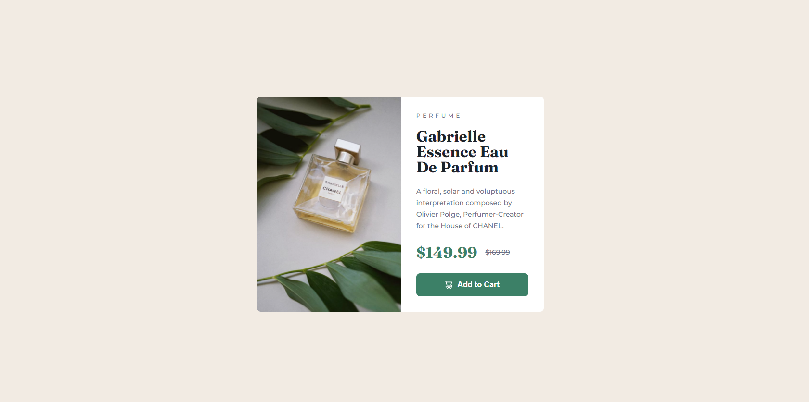

# Frontend Mentor - Product preview card component solution

This is a solution to the [Product preview card component challenge on Frontend Mentor](https://www.frontendmentor.io/challenges/product-preview-card-component-GO7UmttRfa). Frontend Mentor challenges help you improve your coding skills by building realistic projects.

## Table of contents

- [Overview](#overview)
  - [The challenge](#the-challenge)
  - [Screenshot](#screenshot)
  - [Links](#links)
- [My process](#my-process)
  - [Built with](#built-with)
  - [What I learned](#what-i-learned)
  - [Continued development](#continued-development)
  - [Useful resources](#useful-resources)
- [Author](#author)
- [Acknowledgments](#acknowledgments)

## Overview

### The challenge

Users should be able to:

- View the optimal layout depending on their device's screen size
- See hover and focus states for interactive elements

### Screenshot

### Links

- Solution URL: [Solution URL here](https://your-solution-url.com)
- Live Site URL: [Live site URL here](https://scintillating-sprinkles-bb93fb.netlify.app/)

## My process

### Built with

- Semantic HTML5 markup
- CSS custom properties
- Flexbox

### Useful resources

- [PX to REM conventer](https://nekocalc.com/px-to-rem-converter) -
  It's really helpful to [use rem instead of px](https://uxdesign.cc/why-designers-should-move-from-px-to-rem-and-how-to-do-that-in-figma-c0ea23e07a15) .However, since I'm mostly familiar with pixel sizes, I decide to use a simple converter for rem size.

## Author

- Frontend Mentor - [@sefaonder](https://www.frontendmentor.io/profile/sefaonder)
